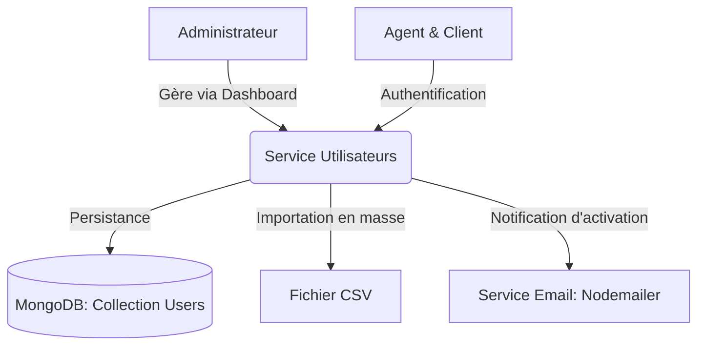

# Plan d'Implémentation : Service Utilisateurs 👥

Ce document détaille l'architecture, la conception de la base de données, les routes API et la structure du frontend pour la première phase du **Système de Billetterie Intelligente** : le **Service Utilisateurs**.

---

## 1. Architecture Globale du Service

Le Service Utilisateurs gère les comptes de trois rôles : **Administrateurs**, **Agents** et **Clients**. Il s'occupe de la sécurité (authentification, hachage, contrôle d'accès), de l'importation de données (CSV), de l'activation des comptes et du suivi statistique global.



---

## 2. Modèle de Données (Mongoose Schema)

Le schéma MongoDB représentera l'utilisateur unique avec un champ `role` pour définir ses privilèges et un champ `status` pour le cycle de vie du compte.

### Fichier proposé : `backend/src/models/User.js`

```javascript
import mongoose from 'mongoose';
import bcrypt from 'bcryptjs';

const UserSchema = new mongoose.Schema({
  nom: {
    type: String,
    required: [true, "Le nom est obligatoire"],
    trim: true
  },
  prenom: {
    type: String,
    required: [true, "Le prénom est obligatoire"],
    trim: true
  },
  email: {
    type: String,
    required: [true, "L'adresse email est obligatoire"],
    unique: true,
    lowercase: true,
    trim: true,
    match: [/\S+@\S+\.\S+/, "Veuillez entrer un email valide"]
  },
  telephone: {
    type: String,
    required: [true, "Le numéro de téléphone est obligatoire"],
    trim: true
  },
  role: {
    type: String,
    enum: ['Administrateur', 'Agent', 'Client'],
    default: 'Client'
  },
  status: {
    type: String,
    enum: ['Actif', 'Bloqué', 'Supprimé'],
    default: 'Bloqué' // Les comptes créés attendent l'activation pour passer à 'Actif'
  },
  photo: {
    type: String, // URL ou chemin de l'image de profil
    default: ''
  },
  password: {
    type: String,
    required: [true, "Le mot de passe est obligatoire"]
  },
  mustChangePassword: {
    type: Boolean,
    default: false // Force le changement au premier login si créé par l'admin
  }
}, {
  timestamps: true // Génère createdAt et updatedAt
});

// Middleware pour hacher le mot de passe avant la sauvegarde
UserSchema.pre('save', async function (next) {
  if (!this.isModified('password')) return next();
  try {
    const salt = await bcrypt.genSalt(10);
    this.password = await bcrypt.hash(this.password, salt);
    next();
  } catch (error) {
    next(error);
  }
});

// Méthode pour comparer les mots de passe
UserSchema.methods.comparePassword = async function (candidatePassword) {
  return await bcrypt.compare(candidatePassword, this.password);
};

export default mongoose.model('User', UserSchema);
```

---

## 3. Spécifications des APIs (REST Endpoints)

### A. Authentification & Profil (`backend/src/routes/auth.js`)

| Méthode | Endpoint | Accès | Description | Corps de la requête |
| :--- | :--- | :--- | :--- | :--- |
| **POST** | `/api/auth/login` | Public | Connecter un utilisateur, retourne un JWT. | `{ email, password }` |
| **POST** | `/api/auth/logout` | Connecté | Déconnecter l'utilisateur (invalidation côté client). | Aucun |
| **GET** | `/api/users/profile` | Connecté | Obtenir les informations du compte connecté. | Aucun (via JWT) |
| **PUT** | `/api/users/profile` | Connecté | Mettre à jour nom, prénom, téléphone et photo. | `{ nom, prenom, telephone, photo }` |
| **PUT** | `/api/users/profile/password` | Connecté | Modifier le mot de passe après confirmation de l'ancien. | `{ oldPassword, newPassword }` |

### B. Gestion Administrative (`backend/src/routes/admin.js`)
*Nécessite un middleware d'autorisation administrateur (`isAdmin`).*

| Méthode | Endpoint | Description | Corps de la requête / Query Params |
| :--- | :--- | :--- | :--- |
| **POST** | `/api/admin/users` | Créer un utilisateur individuel (Administrateur, Agent ou Client). | `{ nom, prenom, email, telephone, role }` |
| **POST** | `/api/admin/users/import` | Importer en masse des utilisateurs via un fichier CSV. | Fichier Multipart (`file`) |
| **GET** | `/api/admin/users` | Consulter la liste filtrée et recherchable des utilisateurs. | Query Params: `role`, `status`, `search` (email, tél, ID) |
| **PATCH** | `/api/admin/users/bulk-status` | Activer, bloquer ou supprimer un groupe de comptes. | `{ userIds: [...], action: 'Activer' \| 'Bloquer' \| 'Supprimer' }` |
| **GET** | `/api/admin/dashboard/stats` | Récupérer les indicateurs et les métriques des rôles. | Aucun |

---

## 4. Logiques Métier Clés

### A. Importation CSV
1. **Format du fichier CSV :**
   ```csv
   nom,prenom,email,telephone,role
   Dupont,Jean,jean.dupont@email.com,+221771234567,Client
   Diop,Aminata,aminata.diop@email.com,+221781234567,Agent
   ```
2. **Processus d'importation :**
   - Utilisation de `multer` pour uploader le fichier temporairement.
   - Lecture en flux (stream) avec `csv-parser`.
   - Pour chaque ligne :
     - Vérifier la validité des champs.
     - Vérifier si l'adresse email existe déjà en base de données.
     - Si valide, générer un mot de passe temporaire aléatoire (8 caractères).
     - Insérer l'utilisateur en base de données avec le statut `Bloqué` (par défaut).
     - Envoyer un email contenant les identifiants temporaires si demandé ou lors de l'activation ultérieure.

### B. Activation de Compte & Envoi d'Email
Lors de l'activation d'un ou plusieurs comptes par l'administrateur :
1. Générer un mot de passe temporaire alphanumérique de 8 caractères :
   ```javascript
   const tempPassword = Math.random().toString(36).slice(-8);
   ```
2. Mettre à jour l'utilisateur en base :
   - `password` = `tempPassword` (le middleware `pre('save')` va s'occuper du hachage).
   - `status` = `'Actif'`.
   - `mustChangePassword` = `true`.
3. Envoyer un email avec `nodemailer` :
   > **Sujet :** Activation de votre compte - Système de Billetterie
   > **Corps :** Bonjour [Prénom], votre compte a été activé. Utilisez les identifiants suivants pour vous connecter :
   > - **Email :** [Email]
   > - **Mot de passe temporaire :** [TempPassword]
   > *Il vous sera demandé de modifier ce mot de passe lors de votre première connexion.*

---

## 5. Structure Frontend React suggérée

Pour l'interface utilisateur, nous utiliserons un layout adaptatif moderne avec un Dashboard Admin bien structuré.

### A. Composants à créer (`frontend/src/components/`)
* **`Navbar.jsx` / `Sidebar.jsx`** : Navigation globale pour l'administration et le profil.
* **`StatsCard.jsx`** : Bloc réutilisable pour afficher les KPI (ex. "Total Clients", "Clients Actifs").
* **`UserTable.jsx`** : Tableau dynamique avec checkboxes pour sélection groupée, pagination, et actions de statut.
* **`UserImportModal.jsx`** : Dialogue d'upload de fichier CSV avec zone de glisser-déposer (Drag & Drop).
* **`UserFormModal.jsx`** : Formulaire de création/édition d'un utilisateur individuel.

### B. Vues / Pages à créer (`frontend/src/pages/`)
* **`Login.jsx`** : Écran d'authentification épuré et sécurisé.
* **`AdminDashboard.jsx`** : Vue d'accueil affichant les indicateurs statistiques sous forme de grilles et de compteurs.
* **`UserManagement.jsx`** : Espace principal pour gérer (filtrer, rechercher, actions groupées) les comptes.
* **`ProfileSettings.jsx`** : Page personnelle de l'administrateur permettant de modifier sa photo, ses infos et changer son mot de passe.

---

## 6. Répartition suggérée des tâches (Méthode Agile / Trello)

Si vous travaillez à plusieurs, voici comment séparer le travail pour cette première partie :

| Développeur A (Backend) | Développeur B (Backend) | Développeur C (Frontend) | Développeur D (Frontend) |
| :--- | :--- | :--- | :--- |
| Configurer le modèle `User` et mettre en place l'Auth JWT (`login`, `logout`, middleware `auth`). | Configurer `nodemailer` et la logique de génération du mot de passe temporaire de 8 caractères. | Créer l'interface de connexion (`Login.jsx`) et l'intégration des tokens JWT (Context/Redux). | Créer le layout principal du Dashboard avec la Sidebar et les KPI statistiques (`AdminDashboard.jsx`). |
| Créer le CRUD utilisateur individuel et le moteur de recherche et filtrage avancé. | Développer l'importation de fichiers CSV avec `multer` et `csv-parser` et gérer les doublons. | Créer la vue de gestion des utilisateurs (`UserManagement.jsx`) avec filtrage et recherche. | Intégrer les actions groupées (checkboxes) et l'importation de fichiers CSV en drag-and-drop. |
| Sécuriser les routes de profil et implémenter la modification de mot de passe. | Gérer le téléversement de la photo de profil (ex. stockage local ou Cloudinary). | Créer la page de gestion de profil (`ProfileSettings.jsx`) avec modification de mot de passe et upload photo. | Réaliser la validation des formulaires et l'affichage des notifications Toast de succès/erreur. |
