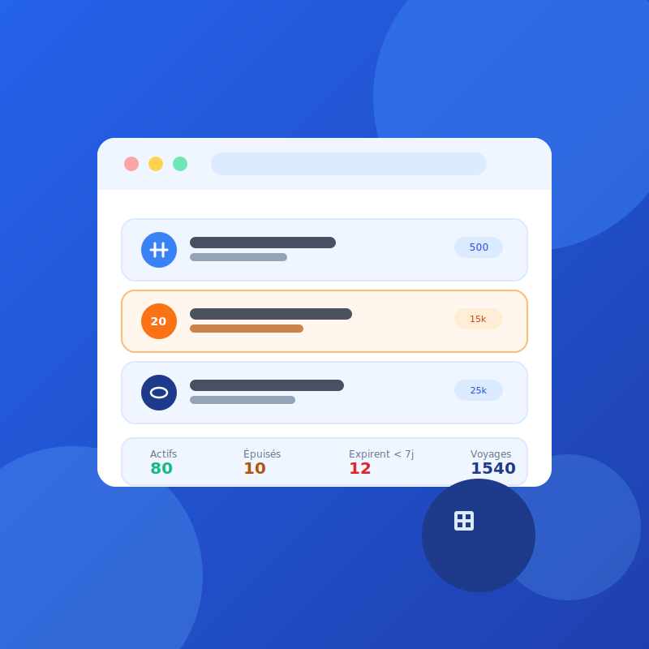

<!-- _paginate: false -->



###### Deuxième phase

# Service Abonnements — Système de billetterie intelligente

**Formules, souscription, consommation des voyages et cycle de vie d'un abonnement**, sur un microservice indépendant (Node/Express/MySQL, port 5060) qui ne partage que le jeton JWT avec le Service Utilisateurs.

Présenté par :
**Makhtar WADE** · **Elhadj Fallou Bousso**

*Juillet 2026*

---

###### 1 · Le périmètre

# Service Abonnements

Catalogue de formules, souscription d'un client, consommation des voyages, cycle de vie d'un abonnement.

Démarré une fois le Service Utilisateurs terminé, avec l'accord du professeur. Le contrat d'API a été figé avant d'écrire une ligne de code : `PLAN-SERVICE-ABONNEMENTS.md`.

Livrables :
- fonctionnalités critiques, plan de tests, tableau de synthèse ;
- microservice indépendant avec sa propre base MySQL ;
- client API simulé côté front, pour ne pas attendre le backend ;
- scénario fonctionnel complet, branches dédiées, PR documentées.

---

###### 1 · Le périmètre

# Qui gère quoi

- **Back (Elhadj Fallou)** : microservice `service-abonnements/` — modèles Sequelize, contrôleurs, vérification des jetons du Service Utilisateurs, 75 tests.
- **Front (Makhtar)** : client API simulé respectant le contrat au champ près, pages Formules et Abonnements, cycle de vie, tableau de bord.

Zones étanches : le back ne touche jamais à `frontend/src/`, le front ne touche jamais à `service-abonnements/src/`.

---

###### 2 · Fonctionnalités critiques

# Intégrité d'un abonnement

- Souscription : date d'expiration et solde de voyages calculés côté backend, jamais recalculés côté front
- **Un seul abonnement Limité ou Illimité en cours par client** — les tickets simples restent cumulables
- Consommation : refusée si expiré, épuisé, suspendu ou résilié, avec le motif exact
- Un scan rejoué (même identifiant de validation) ne décompte jamais deux fois
- Vérification de la validité d'un titre : l'endpoint que consommera le futur Service Billetterie

---

###### 2 · Fonctionnalités critiques

# Cohérence commerciale

- Une formule n'est jamais supprimée, seulement désactivée — pour ne pas casser l'historique des abonnements déjà souscrits
- Tarif, durée et nombre de voyages **figés** dès la première souscription ; nom et description restent modifiables
- Une résiliation est **définitive** : ni réactivation, ni renouvellement

---

###### 3 · Plan de tests

# Deux services, un outillage par côté

| | Back | Front |
|---|---|---|
| Outil | `node:test` + `supertest` | Jest |
| Cible | routes, contrôleurs, modèles | client API simulé + règles de validation |
| Base | MySQL dédiée aux tests | — |
| Auth | jeton signé avec le `JWT_SECRET` du Service Utilisateurs, jamais connecté à Mongo | — |

```bash
npm test --prefix service-abonnements   # 75 tests
npm test --prefix frontend              # 73 tests (51 sur ce périmètre)
```

---

###### 4 · Tableau de synthèse

# 75 tests back, 0 échec

| Bloc | Cas |
|---|---|
| Formules | création, consultation, modification figée après souscription, activation |
| Souscriptions | calcul expiration/solde, un seul abonnement en cours, filtres, cycle de vie |
| Consommation | décompte, scan rejoué, atomicité, motif exact du refus |
| Droit à voyager & tableau de bord | contrat exact, réservé aux rôles autorisés |
| Unitaires | solde de voyages, statut effectif, validation des modèles |

**51 tests API + 24 tests unitaires.**

---

###### 4 · Tableau de synthèse

# Et côté front : 51 tests sur ce périmètre

| Fichier | Cas couverts | Nb |
|---|---|---|
| `validatorsAbonnements.test.js` | Formulaire de formule et de souscription | 12 |
| `apiAbonnements.test.js` | Contrat simulé complet : formules, souscriptions, cycle de vie, consommation | 39 |

Le client API simulé respecte les mêmes codes d'erreur et les mêmes règles métier que le vrai backend — vérifié en confrontant les deux suites de tests, pas seulement en relisant le code.

---

###### 5 · Scénario fonctionnel

# De la formule à la consommation des voyages

1. L'admin crée une formule Limitée (20 voyages, 30 jours, 15 000 FCFA).
2. Il souscrit un client à cette formule → date d'expiration et solde calculés automatiquement.
3. Il tente un second abonnement Limité pour le même client → refusé. Un Ticket simple pour le même client → accepté.
4. Sur la fiche détail, il enregistre des voyages → le solde diminue, l'historique se remplit. Rejouer le même identifiant ne décompte pas deux fois.
5. Il suspend puis réactive l'abonnement, puis le résilie → action définitive.
6. Le tableau de bord reflète exactement ces actions.

---

###### 6 · Anomalies trouvées

# Sept écarts entre le simulateur et le vrai contrat

En écrivant la documentation, comparaison ligne à ligne du simulateur front avec la vraie suite de tests backend — alors que le simulateur annonçait respecter le contrat "au champ près" :

- Formule retirée du catalogue : 404 au lieu de 409
- Aucune limite sur le nombre d'abonnements en cours par client
- Tarif d'une formule modifiable même après souscription
- Une résiliation pouvait être annulée
- Un ticket simple pouvait être "renouvelé"
- Un scan rejoué décomptait deux fois le même voyage
- Le filtre "expire sous N jours" n'existait pas

---

###### 6 · Anomalies trouvées

# Le point commun

Le code applicatif a été écrit avec les tests en parallèle, donc peu de bugs de ce côté. Les écarts ci-dessus venaient d'ailleurs : un fichier qui *déclare* respecter un contrat sans que personne n'ait vérifié les deux côtés l'un contre l'autre.

Les sept corrigés dans la même PR, avec 21 tests supplémentaires pour ne pas les revoir revenir.

---

###### 7 · Git & revue de code

# Une PR par sujet, comme au premier TP

7 Pull Requests sur ce périmètre : le contrat d'API, le client simulé, le microservice back, les pages Formules, les pages Abonnements, le cycle de vie et tableau de bord, puis la mise en conformité du simulateur.

- branches dédiées (`feature/abo-*`, `fix/abo-*`), supprimées après fusion
- PR avec résumé + plan de test avant de demander la relecture
- zones étanches respectées : aucun conflit entre front et back sur ce périmètre

---

<!-- _class: lead -->
<!-- _paginate: false -->


# Merci

## Service Abonnements

**Makhtar WADE** · **Elhadj Fallou Bousso**

*Juillet 2026*
